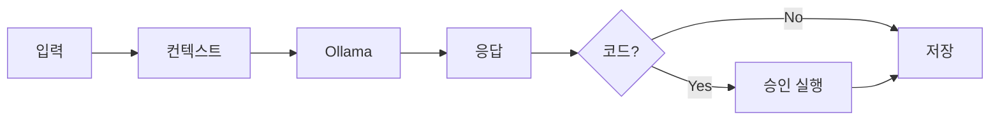
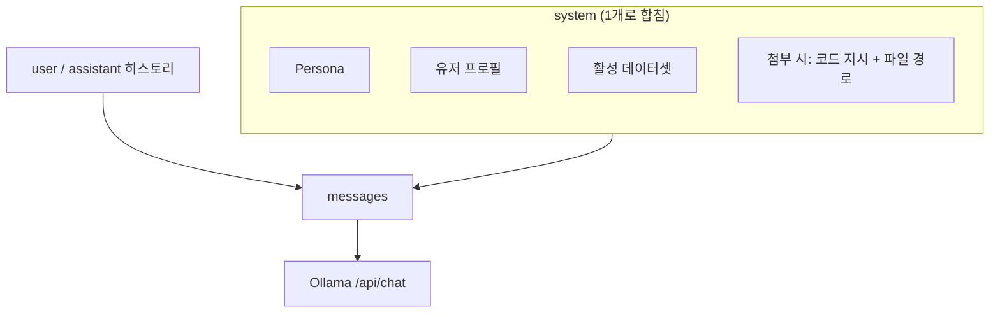
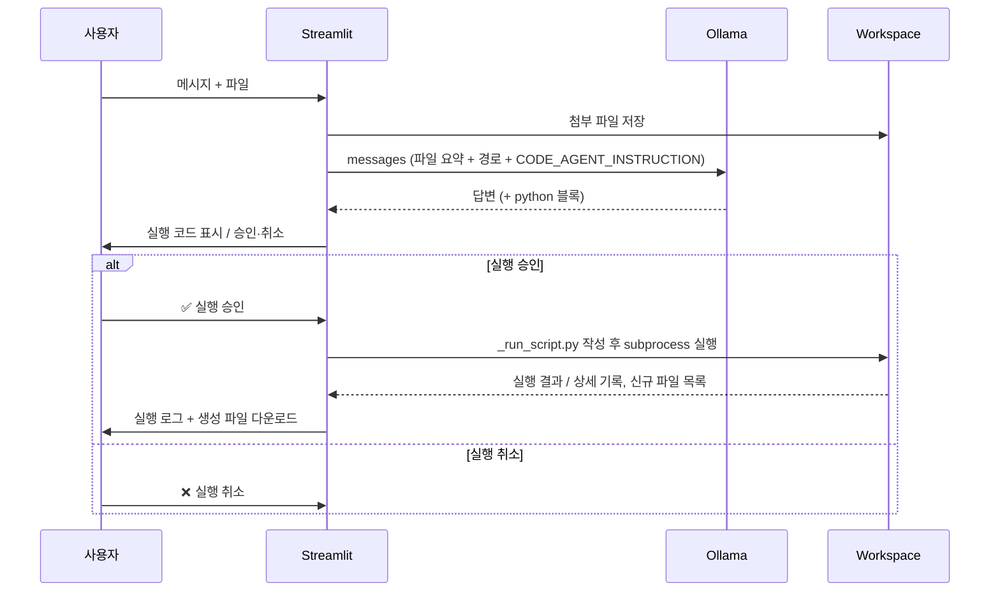
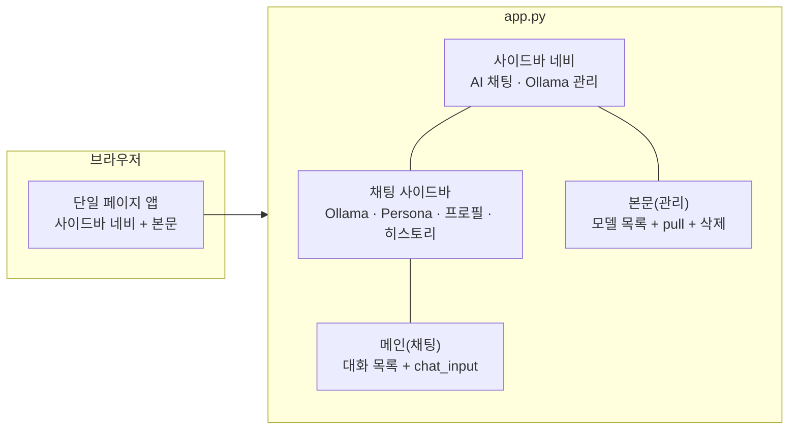

# Basic Software Technology

**Ollama** 기반 로컬 LLM 들과 대화하고, 채팅을 통해 엑셀 작업이 가능하며, 필요 시 Python 코드를 **승인 후 실행**하는 Streamlit 앱입니다.

| 항목 | 내용 |
|------|------|
| UI 프레임워크 | Streamlit (**AI 채팅** · **Ollama 관리** 가능) |
| LLM | Ollama 로 실행하는 로컬 LLM 모델 `POST /api/chat` |
| 진입점 | `app.py` |
| 기본 URL | `http://localhost:8507` |

## Table of contents

1. [LLM 실행 구조](#llm-실행-구조)
2. [시스템의 구성요소](#시스템의-구성요소)
3. [Streamlit](#streamlit)
4. [랜딩페이지](#랜딩페이지)
5. [실행 스크립트](#실행-스크립트)
6. [사용 화면 캡쳐](#사용-화면-캡쳐)

---

## LLM 실행 구조

한 번 메시지를 보낼 때: **입력 처리 → `messages` 조립 → Ollama 1회 호출 → (조건 시) 코드 승인 실행**. 스트리밍 없음 (`stream: false`).

### 한눈에 보기



### `system` 메시지 조립



| system 블록 | 설정 위치 |
|-------------|-----------|
| Persona | 사이드바 · Preset 3종 + Custom (`app_settings.json`) |
| 프로필 | 모달 · `user_profile.json` |
| 데이터셋 | `st.session_state.df` 요약 |
| 첨부 지시 | 파일 있을 때만 · workspace 경로 포함 |


### 파일 첨부 · 코드 실행 구조

파일이 있거나 활성 데이터셋(`df`)이 있으면, 모델이 ` ```python ` 블록을 내면 **자동 실행하지 않고** 승인 UI를 띄웁니다. 아래 시퀀스는 **승인 이후 workspace 실행** 단계를 시간 순으로 보여 줍니다.



| 단계 | 함수 | 설명 |
|------|------|------|
| 작업 폴더 | `get_chat_workspace()` | `chat_history/workspaces/{active_chat_id}/` |
| 실행 | `execute_python_code()` | `sys.executable`로 스크립트 실행, cwd=workspace, 타임아웃 120초 |
| 신규 파일 | `list_workspace_files()` diff | 실행 전후 파일 비교 → 다운로드 버튼 |
| 상태 저장 | `patch_message()` | `execution_status`, `execution_result` 메시지에 기록 |

**실행 상태 (`execution_status`):**

- `pending` — 승인 대기
- `completed` — 실행 완료 (결과·다운로드 표시)
- `cancelled` — 사용자 취소

---

## 시스템의 구성요소

이 저장소는 Streamlit 기반 **단일 앱 파일(`app.py`)** 중심입니다. (React·별도 프론트·랜딩 HTML은 없습니다.)

### 저장소 구조

```
basic-sw-tech-sm/
├── app.py                    # UI · Ollama · 파일 · 코드 실행 (전부 여기)
├── requirements.txt          # Python 패키지
├── sm_final.png              # 브라우저 탭 파비콘
├── docs/screenshots/         # README용 사용 화면 캡처 (PNG)
├── .streamlit/config.toml    # Streamlit 서버 설정 (포트 8507)
├── chat_history/             # 실행 중 생성 (대화·프로필·workspace)
└── README.md
```

| 파일 / 폴더 | 역할 |
|-------------|------|
| `app.py` | `st.navigation`으로 페이지 구성 + 채팅/관리 UI + Ollama 호출 |
| `.streamlit/config.toml` | 포트 `8507`, headless 모드 |
| `chat_history/index.json` | 대화 목록·메시지 영속 저장 |
| `chat_history/user_profile.json` | 이름·언어·시간대 등 (선택 입력) |
| `chat_history/app_settings.json` | Persona 선택·커스텀 Persona |
| `chat_history/workspaces/{id}/` | 첨부 파일·코드 실행 결과 파일 |
| `docs/screenshots/` | README에 넣을 스크린샷(PNG) 보관 |

### 앱 화면 구조 (Streamlit)



---

## Streamlit

이 프로젝트에서 Streamlit은 **UI 프레임워크**입니다.

- **역할**: 채팅 UI, 사이드바, 파일 업로드, 세션 상태 관리, 코드 승인 UI, 코드 실행 결과 표시
- **하지 않는 일**: LLM 추론(그건 Ollama가 담당), 별도 프론트엔드/SPA 빌드

또한 `st.navigation`을 사용해서 **페이지 2개**로 나뉩니다.

- **AI 채팅**: 대화 + (채팅용) 사이드바 설정
- **Ollama 관리**: 모델 목록 확인, 모델 다운로드(`pull`) 진행 표시, 모델 삭제

---

## 랜딩페이지

이 저장소에는 **별도의 랜딩페이지가 없습니다.**

- React/Next.js 같은 별도 프론트나 `index.html`을 두지 않습니다.
- 브라우저에서 보이는 화면은 Streamlit이 만든 UI이고, 실행 즉시 앱 화면(네비/채팅/관리)로 진입합니다.

---

## 실행 스크립트

별도 `run.sh` / `run.bat` / `docker-compose.yml` 없이, 아래 명령으로 실행합니다.

```powershell
pip install -r requirements.txt
streamlit run app.py          # .streamlit/config.toml → 포트 8507 (수정 가능)
```

> LLM이 생성한 코드는 승인 후 `workspaces/{대화ID}/_run_script.py`로 **임시 실행**됩니다. 이 파일은 앱을 띄우는 실행 스크립트와 무관합니다.

---

## 사용 화면 캡쳐

### 요청 의도별 코드 생성

사용자의 승인을 받아 실행 후에 생성된 파일을 받을 수 있습니다.


### 시스템 프롬프팅 페르소나화

프리셋 페르소나 외 사용자가 생성 및 관리할 수 있습니다.


### Ollama 관리

SSH 터널로 원격 Ollama에 연결한 뒤, 모델 목록 확인·`pull` 다운로드·삭제를 할 수 있습니다.


