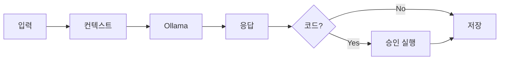
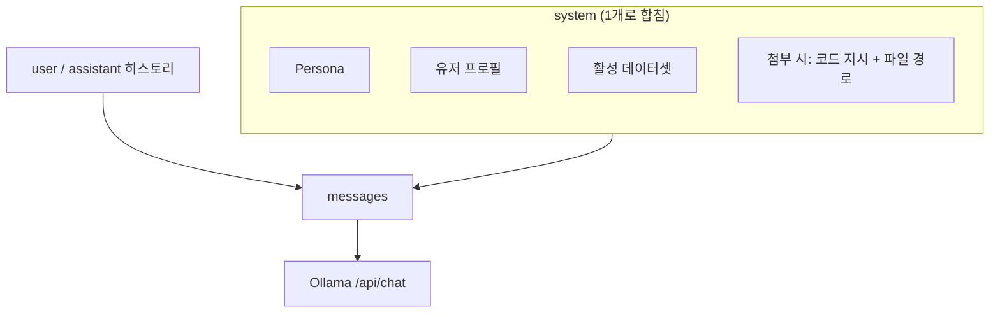
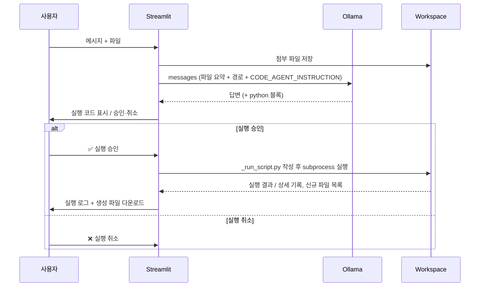
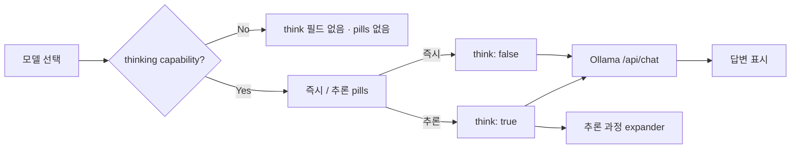
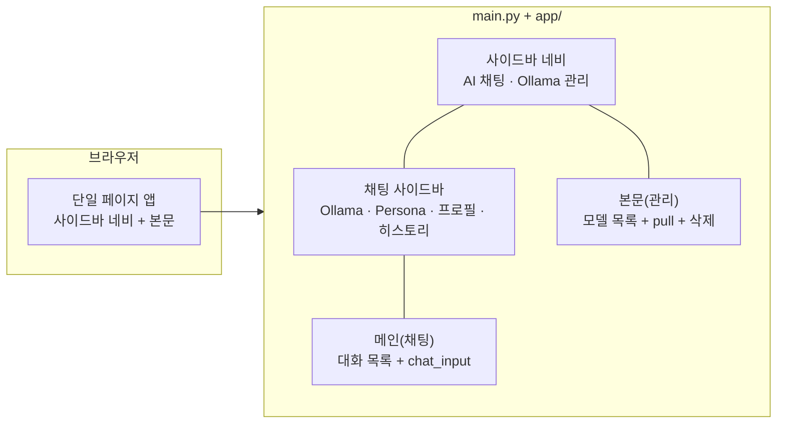

# Basic Software Technology

**Ollama** 기반 로컬 LLM 들과 대화하고, 채팅을 통해 엑셀 작업이 가능하며, 필요 시 Python 코드를 **승인 후 실행**하는 Streamlit 앱입니다.

| 항목 | 내용 |
|------|------|
| UI 프레임워크 | Streamlit (**AI 채팅** · **Ollama 관리** 가능) |
| LLM | Ollama 로 실행하는 로컬 LLM 모델 `POST /api/chat` |
| 진입점 | `main.py` |
| 기본 URL | `http://localhost:8507` |

## Table of contents

1. [LLM 실행 구조](#llm-architecture)
2. [시스템의 구성요소](#system-components)
3. [Streamlit](#streamlit)
4. [랜딩페이지](#landing-page)
5. [실행 스크립트](#run-script)
6. [사용 화면 캡처](#usage-screenshots)
7. [Claude Code / Codex skill과의 연관](#ai-codex-skills)

---

<a id="llm-architecture"></a>

## LLM 실행 구조

한 번 메시지를 보낼 때: **입력 처리 → `messages` 조립 → Ollama 1회 호출 → (조건 시) 코드 승인 실행**. 스트리밍 없음 (`stream: false`).

### 한눈에 보기



### `system` 메시지 조립



| system 블록 | 코드 위치 · 저장 |
|-------------|------------------|
| Persona | `app/ui/shared/persona.py` · 사이드바 · `chat_history/app_settings.json` |
| 프로필 | `app/ui/shared/profile.py` · 모달 · `chat_history/user_profile.json` |
| 데이터셋 | `app/services/uploads.py` 요약 · `st.session_state.df` |
| 첨부 지시 | `app/services/chat_llm.py` · `CODE_AGENT_INSTRUCTION` · workspace 경로 |


### 파일 첨부 · 코드 실행 구조

파일이 있거나 활성 데이터셋(`df`)이 있으면, 모델이 ` ```python ` 블록을 내면 **자동 실행하지 않고** 승인 UI를 띄웁니다. 아래 시퀀스는 **승인 이후 workspace 실행** 단계를 시간 순으로 보여 줍니다.



| 단계 | 모듈 · 함수 | 설명 |
|------|-------------|------|
| 작업 폴더 | `app/session.py` · `get_chat_workspace()` | `chat_history/workspaces/{active_chat_id}/` |
| 실행 | `app/services/code_exec.py` · `execute_python_code()` | `sys.executable`로 스크립트 실행, cwd=workspace, 타임아웃 120초 |
| 신규 파일 | `app/services/workspace.py` · `list_workspace_files()` diff | 실행 전후 파일 비교 → 다운로드 버튼 |
| 상태 저장 | `app/session.py` · `patch_message()` | `execution_status`, `execution_result` 메시지에 기록 |
| LLM 호출 | `app/services/chat_llm.py` · `call_ollama()` | `POST /api/chat`, `stream: false` |
| 응답 모드 | `app/ui/chat/response_mode.py` · `app/services/chat_llm.py` | thinking 지원 모델만 `think: true` / `false` (자세한 내용은 아래) |

### 즉시 응답 / 추론 응답

Ollama **thinking capability**가 있는 모델(qwen3, deepseek-r1 등)만, 채팅 입력창 **바로 위**에서 **즉시** / **추론** pills로 구분합니다. (`POST /api/show` → `capabilities`에 `"thinking"` 포함 여부)

| 모드 | API | 동작 |
|------|-----|------|
| **즉시** (`instant`) | `think: false` | 추론 trace 없이 `message.content` 위주로 응답 |
| **추론** (`thinking`) | `think: true` | `message.thinking`(추론 과정) + `message.content`(최종 답변) 분리 |



- capability 없는 모델: pills 미표시, `think` 파라미터를 보내지 않음 (일반 채팅).
- UI·완료 caption: [Streamlit](#streamlit) 참고.

**실행 상태 (`execution_status`):**

- `pending` 승인 대기
- `completed` 실행 완료 (결과·다운로드 표시)
- `cancelled` 사용자 취소

---

<a id="system-components"></a>

## 시스템의 구성요소

이 저장소는 Streamlit 기반 **`main.py` + `app/` 패키지** 구조입니다. (React·별도 프론트·랜딩 HTML은 없습니다.)

### 저장소 구조

```
basic-sw-tech-sm/
├── main.py                         # Streamlit 진입 (set_page_config · navigation)
├── app/                            # 애플리케이션 패키지
│   ├── __init__.py
│   ├── config.py                   # Ollama URL · Material 아이콘 · chat_history 경로
│   ├── utils.py                    # new_chat · now_iso
│   ├── session.py                  # st.session_state · 대화 CRUD · workspace · 업로드
│   ├── bootstrap.py                # page_chat / page_ollama → UI 모듈 연결
│   ├── api/
│   │   └── ollama.py               # tags · version · pull · delete · show(capabilities)
│   ├── services/
│   │   ├── storage.py              # index.json · 프로필 · app_settings 영속화
│   │   ├── chat_state.py           # 메시지 append / patch · 세션 초기화
│   │   ├── chat_io.py              # 대화 import/export (JSON · MD)
│   │   ├── chat_llm.py             # messages 조립 · Ollama POST /api/chat
│   │   ├── workspace.py            # 대화별 작업 폴더 · 첨부 파일 복사
│   │   ├── code_exec.py            # Python 블록 추출 · subprocess 실행
│   │   └── uploads.py              # CSV/Excel/텍스트 파싱 · 데이터 요약
│   └── ui/
│       ├── chat/
│       │   ├── page.py             # 채팅 본문 · chat_input · Ollama 호출 루프
│       │   ├── sidebar.py          # Ollama URL · Persona · 프로필 · 히스토리
│       │   ├── response_mode.py    # 즉시/추론 pills · capability 판별 · st.bottom
│       │   ├── thinking_status.py  # 대기 스피너 · 완료 caption(즉시·/추론·N초)
│       │   └── messages.py         # 메시지 렌더 · 코드 승인 UI
│       ├── ollama/
│       │   └── page.py             # 모델 목록 · pull · 삭제
│       ├── shared/
│       │   ├── persona.py          # Persona 프리셋 · 커스텀 · system prompt
│       │   └── profile.py          # 사용자 프로필 모달
│       └── components/
│           └── file_preview.py     # 첨부 파일 미리보기
├── requirements.txt
├── setup.txt                       # venv · CUDA 참고 (선택)
├── sm_final.png                    # 브라우저 탭 파비콘
├── docs/screenshots/               # README용 캡처 (PNG)
├── .streamlit/config.toml          # 포트 8507 · headless
├── chat_history/                   # 실행 중 생성 (git 제외)
└── README.md
```

| 경로 | 역할 |
|------|------|
| `main.py` | `st.navigation`으로 **AI 채팅** · **Ollama 관리** 페이지 등록 후 실행 |
| `app/bootstrap.py` | `page_chat` → `ui/chat/sidebar` + `ui/chat/page`, `page_ollama` → `ui/ollama/page` |
| `app/session.py` | `init_session_state`, `get_chat_workspace`, `append_message` 등 채팅 세션 API |
| `app/services/chat_llm.py` | `build_api_messages`, `call_ollama`, LLM 요청 본문 |
| `app/api/ollama.py` | 모델 목록·버전·pull·delete · `show`(capabilities) · `ps`(로드 상태) |
| `app/ui/chat/response_mode.py` | thinking 지원 시 pills · `render_chat_bottom_bar` |
| `app/ui/chat/thinking_status.py` | `run_with_thinking_status` · `format_thinking_label` |
| `app/ui/ollama/page.py` | **서버 리소스(디스크/로드/VRAM)** + 모델 pull/delete UI |
| `.streamlit/config.toml` | 기본 포트 `8507`, headless 모드 |
| `chat_history/index.json` | 대화 목록·메시지 영속 저장 |
| `chat_history/user_profile.json` | 이름·언어·시간대 등 (선택 입력) |
| `chat_history/app_settings.json` | Persona 선택·커스텀 Persona |
| `chat_history/workspaces/{id}/` | 첨부 파일·코드 실행 결과 파일 |
| `docs/screenshots/` | README에 넣을 스크린샷(PNG) 보관 |

### 앱 화면 구조 (Streamlit)



---

<a id="streamlit"></a>

## Streamlit

Streamlit을 쓰는 이유는 **파이썬 코드만으로 빠르게 데이터/AI 앱 UI**을 만들 수 있기 입니다.

Streamlit이 특히 잘 맞는 상황:
- 프로토타입이 빠름: `st.button`, `st.file_uploader`, `st.dataframe`, `st.chat_input` 같은 컴포넌트로 바로 화면 구성
- 데이터/ML/LLM 데모에 최적화: Pandas/Plotly/matplotlib/scikit-learn/LangChain/OpenAI API 같은 파이썬 생태계와 자연스럽게 연결
- 비개발자에게 공유하기 쉬움: 노트북보다 “앱” 형태라 버튼/파일 업로드 → 결과 확인 흐름이 직관적
- 프론트엔드 개발 부담이 작음: UI를 매우 세밀하게 커스터마이즈할 필요가 없으면 구현 속도가 빨라짐
- 내부 도구에 적합: 대시보드, 리포트 자동화, 문서 요약기, RAG 검색기, CSV 분석기 같은 사내 도구

다만 항상 좋은 선택은 아닙니다. 복잡한 사용자 권한, 대규모 트래픽, 정교한 UI/UX, 모바일 최적화, 실시간 협업이 중요하면 FastAPI + React/Next.js 같은 구조가 더 적합할 수 있습니다.

본 프로젝트에서는 `main.py`에서 `st.navigation`으로 **페이지 2개**를 등록합니다.

| 페이지 | UI 모듈 | 내용 |
|--------|---------|------|
| **AI 채팅** | `app/ui/chat/page.py` + `sidebar.py` | 대화 · 파일 첨부 · 코드 승인 실행 |
| **Ollama 관리** | `app/ui/ollama/page.py` | 모델 목록 · `pull` 진행 · 삭제 · **서버 리소스(디스크/로드/VRAM)** |

Ollama URL은 두 페이지가 `st.session_state.ollama_base_url`을 공유합니다 (채팅 사이드바에서 설정).

---

<a id="landing-page"></a>

## 랜딩페이지

이 저장소에는 **별도의 랜딩페이지가 없습니다.**

- React/Next.js 같은 별도 프론트나 `index.html`을 두지 않습니다.
- 브라우저에서 보이는 화면은 Streamlit이 만든 UI이고, 실행 즉시 앱 화면(네비/채팅/관리)로 진입합니다.

---

<a id="run-script"></a>

## 실행 스크립트

별도 `run.sh` / `run.bat` / `docker-compose.yml` 없이, 아래 명령으로 실행합니다.

```powershell
pip install -r requirements.txt
streamlit run main.py         # .streamlit/config.toml → 포트 8507 (수정 가능)
```

> LLM이 생성한 코드는 승인 후 `workspaces/{대화ID}/_run_script.py`로 **임시 실행**됩니다. 이 파일은 앱을 띄우는 실행 스크립트와 무관합니다.

---

<a id="usage-screenshots"></a>

## 사용 화면 캡처

### 요청 의도별 코드 생성

사용자의 승인을 받아 코드를 실행한 뒤, 생성된 결과 파일을 다운로드할 수 있습니다.


### 시스템 프롬프팅 페르소나화

프리셋 페르소나 외에도 사용자가 원하는 페르소나를 제한 없이 생성하고 관리할 수 있습니다.


### 사용자 프로필

채팅 사이드바에서 `이름`, `호칭`, `언어`, `시간대`, `자기소개`를 선택 입력하면, 이후 대화의 시스템 메시지에 전역 변수로 반영되어 맞춤 응답에 활용됩니다.


### Ollama 관리

SSH 터널로 원격 Ollama에 연결한 뒤, 모델 목록 확인, `pull` 다운로드, 삭제를 할 수 있습니다.


### 서버 리소스

Ollama 관리 페이지 상단에서 **서버 리소스**를 확인할 수 있습니다.

- **모델 저장(디스크)**: 설치된 모델의 디스크 사용량 합계 (`/api/tags` 기반)
- **메모리 로드 / VRAM 로드 합계**: 현재 메모리에 올라간 모델과 VRAM 사용량 (`/api/ps` 기반)
- (지원 시) **시스템 RAM / GPU VRAM**도 함께 표시됩니다. (`/api/info`가 없는 버전에서는 일부 항목이 제한될 수 있습니다.)


### 즉시 응답 / 추론 응답

추론 기능이 있는 모델을 선택하면, 채팅 입력창 위에 **즉시** / **추론** 이 표시되며 Ollama의 `think` 옵션을 전환할 수 있습니다.

- **즉시**: 바로 답변 위주로 응답합니다 (`think: false`). 완료 후 caption 예: `즉시 · 3.2초`.
- **추론**: 모델의 thinking 출력을 **추론 과정 (Thinking)** expander에 표시한 뒤, 최종 답변을 본문에 표시합니다 (`think: true`). 완료 후 caption 예: `추론 · 12.1초`.
- 추론 기능이 없는 모델: 클릭 요소가 표시되지 않으며, 일반 채팅과 동일하게 동작합니다.


---

<a id="ai-codex-skills"></a>

## Claude Code / Codex skill과의 연관

Claude Code / Codex 계열의 **코드 에이전트 skill**을, 본 구현의 기능과 연결하면 다음처럼 정리할 수 있습니다.

- 코드 작성/수정: 모델이 ` ```python ` 블록을 만들면 **자동 실행하지 않고** 코드 승인 UI로 전달한 뒤 실행합니다.
- 파일/데이터 다루기: CSV/Excel 업로드 및 데이터 요약 후, workspace에 첨부 파일을 저장해 다음 단계에 활용합니다.
- 툴 사용(실행): 승인된 뒤에 `subprocess`로 `_run_script.py`를 실행하고, 실행 로그와 결과 파일(다운로드)을 제공합니다.
- 반복/검증 루프: 실행 결과로 생성된 파일은 다운로드 및 다음 턴 컨텍스트로 이어지며, 대화/워크스페이스 히스토리가 남습니다.
- 안전장치: 실행 상태(`pending`/`completed`/`cancelled`)와 workspace 격리로 “무단 실행”을 방지합니다.
- 인지 깊이 제어(추론 vs 즉시): thinking-capability 모델에서 `즉시`/`추론` 모드를 선택해 `think` 파라미터와 (선택) thinking trace expander를 운용합니다.
