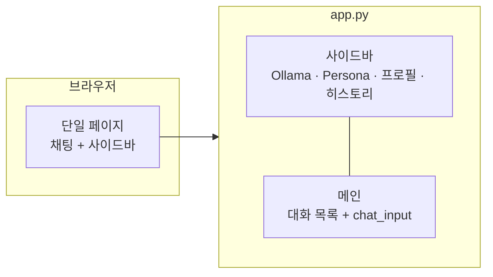
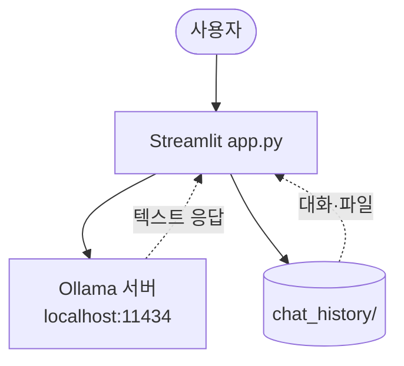
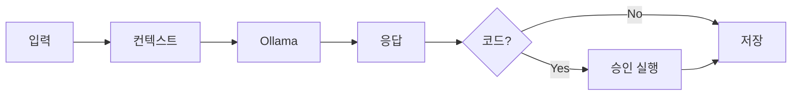
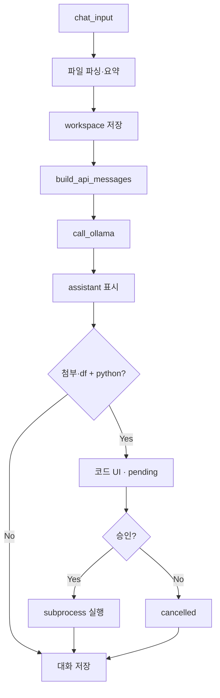
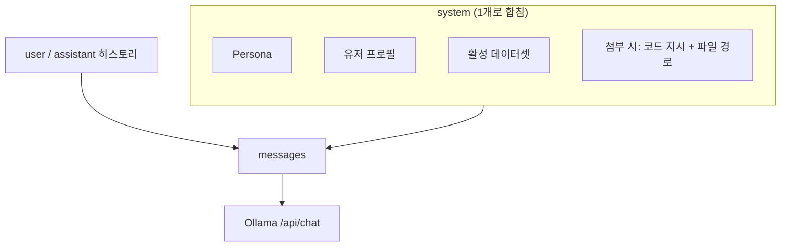
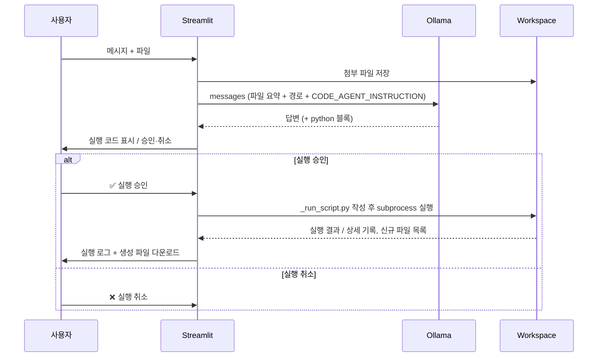
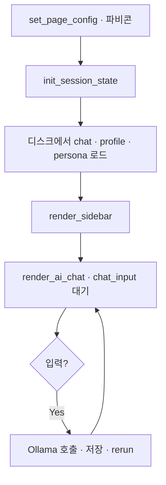

# Basic Software Technology

**Ollama** 기반 로컬 LLM 들과 대화하고, 채팅을 통해 엑셀 작업이 가능하며, 필요 시 Python 코드를 **승인 후 실행**하는 Streamlit 앱입니다.

| 항목 | 내용 |
|------|------|
| UI 프레임워크 | Streamlit (별도 랜딩 페이지 없음 — 실행 즉시 채팅 화면) |
| LLM | Ollama `POST /api/chat` |
| 진입점 | `app.py` |
| 기본 URL | `http://localhost:8507` |

---

## 시스템의 구성요소

이 저장소는 Streamlit 기반 **단일 앱 파일(`app.py`)** 중심입니다. React·별도 프론트·랜딩 HTML은 없습니다.

### 저장소 구조

```
basic-sw-tech-sm/
├── app.py                    # UI · Ollama · 파일 · 코드 실행 (전부 여기)
├── requirements.txt          # Python 패키지
├── sm_final.png              # 브라우저 탭 파비콘
├── .streamlit/config.toml    # Streamlit 서버 설정 (포트 8507)
├── chat_history/             # 실행 중 생성 (대화·프로필·workspace)
└── README.md
```

| 파일 / 폴더 | 역할 |
|-------------|------|
| `app.py` | `main()` → 사이드바 설정 + 메인 채팅 루프 |
| `.streamlit/config.toml` | 포트 `8507`, headless 모드 |
| `chat_history/index.json` | 대화 목록·메시지 영속 저장 |
| `chat_history/user_profile.json` | 이름·언어·시간대 등 (선택 입력) |
| `chat_history/app_settings.json` | Persona 선택·커스텀 Persona |
| `chat_history/workspaces/{id}/` | 첨부 파일·코드 실행 결과 파일 |

### 앱 화면 구조 (Streamlit)



| 영역 | 담당 기능 |
|------|-----------|
| **메인** | 메시지 표시, 파일 첨부 입력, 코드 승인·실행 결과 |
| **사이드바** | Ollama URL·모델, 시스템 프롬프트(Persona), 유저 프로필, 대화 관리·보내기 |

### 외부·런타임 구성



| 구성요소 | 하는 일 | 하지 않는 일 |
|----------|---------|----------------|
| **Streamlit** | UI, 세션, 파일 업로드, 코드 승인 UI, subprocess 실행 | LLM 추론 |
| **Ollama** | `messages` 받아 답변 생성 | 파일 저장·코드 실행 |
| **chat_history/** | 대화·설정·workspace 파일 보관 | — |

### 실행 방법 (앱 기동)

별도 `run.sh` / `run.bat`은 없습니다. 아래만 사용합니다.

```powershell
pip install -r requirements.txt
ollama pull qwen3:8b          # 사용할 모델 (예시)
streamlit run app.py          # .streamlit/config.toml → 포트 8507
```

> LLM이 생성한 코드는 승인 후 `workspaces/{대화ID}/_run_script.py`로 **임시 실행**됩니다. 이 파일은 앱을 띄우는 스크립트와 무관합니다.

### 의존성 (`requirements.txt`)

| 패키지 | 용도 |
|--------|------|
| `streamlit` | 웹 UI, `chat_input` 파일 첨부, 모달(`st.dialog`) |
| `pandas` | CSV/Excel 읽기, 데이터 요약 |
| `openpyxl` | Excel(`.xlsx`) 읽기 |

---

## LLM 실행 구조

한 번 메시지를 보낼 때: **입력 처리 → `messages` 조립 → Ollama 1회 호출 → (조건 시) 코드 승인 실행**. 스트리밍 없음 (`stream: false`).

### 한눈에 보기



### 상세 흐름



### `system` 메시지 조립



| system 블록 | 설정 위치 |
|-------------|-----------|
| Persona | 사이드바 · Preset 3종 + Custom (`app_settings.json`) |
| 프로필 | 모달 · `user_profile.json` |
| 데이터셋 | `st.session_state.df` 요약 |
| 첨부 지시 | 파일 있을 때만 · workspace 경로 포함 |

일반 대화만 할 때는 **Persona + 프로필 + 데이터셋(또는 안내 문구) + 히스토리**만 전달됩니다.

---

## 기술 스택

| 구분 | 기술 |
|------|------|
| UI | Streamlit |
| LLM | Ollama (`/api/chat`) |
| 데이터 | pandas, openpyxl |
| 코드 실행 | Python `subprocess` + 대화별 workspace |

---

## 파일 첨부 · 코드 실행 구조

파일이 있거나 활성 데이터셋(`df`)이 있으면, 모델이 ` ```python ` 블록을 내면 **자동 실행하지 않고** 승인 UI를 띄웁니다. 아래 시퀀스는 **승인 이후 workspace 실행** 단계를 시간 순으로 보여 줍니다.



| 단계 | 함수 | 설명 |
|------|------|------|
| 작업 폴더 | `get_chat_workspace()` | `chat_history/workspaces/{active_chat_id}/` |
| 실행 | `execute_python_code()` | `sys.executable`로 스크립트 실행, cwd=workspace, 타임아웃 120초 |
| 신규 파일 | `list_workspace_files()` diff | 실행 전후 파일 비교 → 다운로드 버튼 |
| 상태 저장 | `patch_message()` | `execution_status`, `execution_result` 메시지에 기록 |

**실행 상태 (`execution_status`):**

- `pending` — 승인 대기
- `completed` — 실행 완료 (결과·다운로드 표시)
- `cancelled` — 사용자 취소

---

## 실행 결과 캡쳐

### 요청 의도별 코드 생성

사용자의 승인을 받아 실행 후에 생성된 파일을 받을 수 있습니다.


### 시스템 프롬프팅 페르소나화

프리셋 페르소나 외 사용자가 생성 및 관리할 수 있습니다.


---

## 앱 시작 흐름

`streamlit run app.py` 이후 `app.py` 안에서의 순서입니다.



| 단계 | 함수 | 설명 |
|------|------|------|
| 1 | `main()` | 페이지 설정 |
| 2 | `init_session_state()` | 세션 초기화, `chat_history/` 로드 |
| 3 | `render_sidebar()` | Ollama, Persona, 프로필, 히스토리 |
| 4 | `render_ai_chat()` | 채팅 렌더링·입력 처리 |

---

## LLM 요청 상세

### API 요청 본문

```json
{
  "model": "qwen3:8b",
  "messages": [ ... ],
  "stream": false,
  "options": {
    "temperature": 0.3,
    "num_predict": 2048
  }
}
```

### `messages` 배열

| 순서 | role | 내용 |
|------|------|------|
| 1 | `system` | Persona + 프로필 + 데이터셋 + (선택) 첨부 지시 |
| 2~ | `user` / `assistant` | 현재 대화 전체 (`format_user_message`로 첨부 요약 포함) |

### Ollama 설정

- URL: `http://localhost:11434` (환경변수 `OLLAMA_HOST`)
- 모델 목록: `GET /api/tags` → 사이드바 선택

---

## 메시지 1회 처리 (함수 단위)

```
chat_input
  → process_uploaded_file()
  → prepare_files_in_workspace()
  → apply_chat_files()          # session df
  → build_files_for_model()
  → append_message (user)
  → call_ollama()                 # build_api_messages() 내부
  → extract_python_blocks()       # 첨부·df 있을 때
  → append_message (assistant)
  → st.rerun()
```

---

## 지원 파일 형식

| 확장자 | 앱 처리 | LLM 전달 |
|--------|---------|----------|
| csv, xlsx, xls | DataFrame 요약 + workspace | 요약 + 경로 |
| txt, md, json | 텍스트(최대 12,000자) | 요약 + 경로 |

채팅 첨부 허용: `csv`, `txt`, `md`, `json`, `xlsx`, `xls`

---

## 데이터 저장

```
chat_history/
├── index.json
├── user_profile.json
├── app_settings.json
└── workspaces/
    └── {chat_id}/
```

대화보내기/가져오기: 사이드바에서 JSON 또는 Markdown 선택.

---

## 주요 기본값

| 항목 | 값 |
|------|-----|
| Streamlit 포트 | 8507 |
| Temperature | 0.3 |
| max_tokens | 2048 |
| Ollama 타임아웃 | 300초 |
| 코드 실행 타임아웃 | 120초 |
| 기본 Persona | 데이터 분석가 |

---

## 보안 참고

- LLM이 만든 코드는 **사용자 승인 후**에만 실행됩니다.
- 실행 위치는 `workspaces/{대화ID}/`로 제한되지만, 신뢰할 수 있는 로컬 환경에서만 사용하세요.
