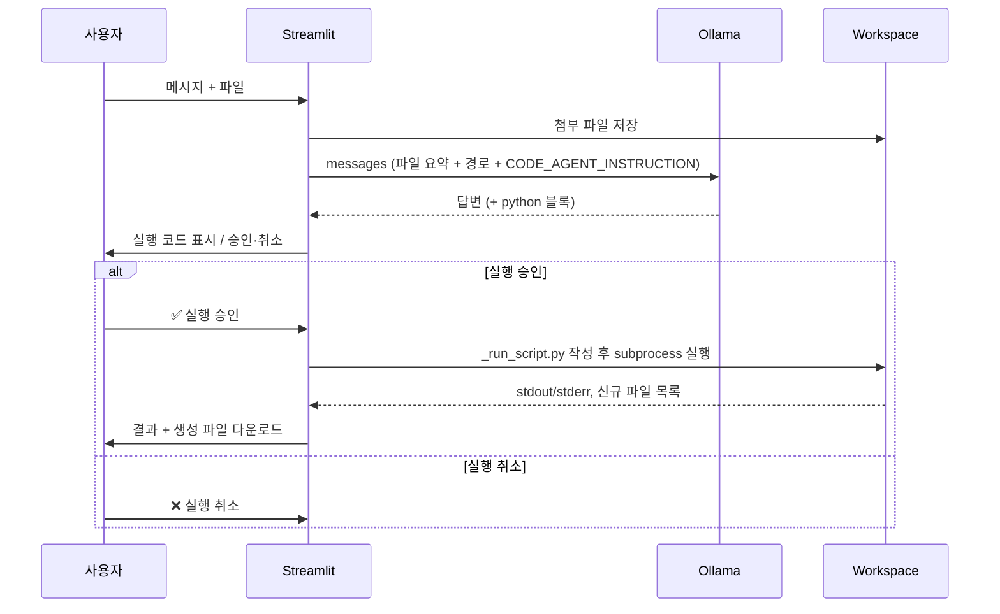

# Basic Software Technology

Streamlit 기반 AI 대화 도구입니다.

**Ollama** 기반 로컬 LLM과 통신하며, 채팅에서 파일을 첨부·분석하고 필요 시 Python 코드를 생성·승인 실행합니다.

- 기본 포트: **8507**
- 진입점: `app.py`

## 기술 스택

| 구분 | 기술 |
|------|------|
| UI | Streamlit |
| LLM | Ollama (`/api/chat`, OpenAI 호환 메시지 형식) |
| 데이터 처리 | pandas, openpyxl |
| 코드 실행 | Python `subprocess` (대화별 작업 폴더) |

## 파일 첨부 · 코드 실행 구조

파일이 있거나 활성 데이터셋(`df`)이 있으면, 모델이 ` ```python ` 블록을 내면 **자동 실행하지 않고** 승인 UI를 띄웁니다.



| 단계 | 함수 | 설명 |
|------|------|------|
| 작업 폴더 | `get_chat_workspace()` | `chat_history/workspaces/{active_chat_id}/` |
| 실행 | `execute_python_code()` | `sys.executable`로 스크립트 실행, cwd=workspace, 타임아웃 120초 |
| 신규 파일 | `list_workspace_files()` diff | 실행 전후 파일 비교 → 다운로드 버튼 |
| 상태 저장 | `patch_message()` | `execution_status`, `execution_result` 메시지에 기록 |

**실행 상태 (`execution_status`):**

- `pending` — 승인 대기
- `completed` — 실행 완료 (결과·다운로드 표시)
- `cancelled` — 사용자 취소

## 실행 결과 캡쳐

### 요청 의도별 코드 생성

사용자의 승인을 받아 실행 후에 생성된 파일을 받을 수 있습니다.


### 시스템 프롬프팅 페르소나화

프리셋 페르소나 외 사용자가 생성 및 관리할 수 있습니다.


## 앱 시작 흐름

1. `main()` → `st.set_page_config`
2. `init_session_state()` — 세션·디스크에서 채팅/프로필/Persona 설정 로드
3. `render_sidebar()` — Ollama URL·모델, 시스템 프롬프트(Persona), 채팅 히스토리, 유저 프로필
4. `render_ai_chat()` — 대화 렌더링 및 `st.chat_input` 대기

## LLM 요청이 만들어지는 방식

한 번의 사용자 전송마다 `call_ollama()`가 호출됩니다. Ollama에는 **비스트리밍** `POST {OLLAMA_URL}/api/chat` 로 전달합니다.

### 요청 본문 구조

```json
{
  "model": "qwen3:8b",
  "messages": [ ... ],
  "stream": false,
  "options": {
    "temperature": 0.3,
    "num_predict": 2048
  }
}
```

### `messages` 배열 구성 (`build_api_messages`)

| 순서 | role | 내용 |
|------|------|------|
| 1 | `system` | 아래 블록을 `\n\n`로 이어 붙인 문자열 |
| 2~ | `user` / `assistant` | 현재 대화의 전체 히스토리 |

**system 메시지에 포함되는 블록 (위에서부터):**

1. **시스템 프롬프트 (Persona)**  
   - Preset: 데이터 분석가 / 코딩 어시스턴트 / 학습 멘토  
   - Custom: 사용자가 저장한 커스텀 Persona (`app_settings.json`)
2. **사용자 프로필** (입력된 항목만)  
   - 이름, 호칭, 사용 언어, 시간대/지역, 자기소개
3. **활성 데이터셋** (`build_active_context`)  
   - `st.session_state.df`가 있으면 `describe`, dtypes, 결측치 등 요약  
   - 없으면 안내 문구
4. **파일 첨부 시 추가** (`attached_files`가 있을 때)  
   - `CODE_AGENT_INSTRUCTION` — Python 코드 블록 작성·작업 폴더 규칙  
   - `build_workspace_file_context` — 첨부 파일명과 디스크 경로

**user 메시지 포맷 (`format_user_message`):**

- 일반 텍스트 + (있으면) `### 첨부: 파일명 (타입)\n{요약}` 반복

### Ollama 연결 설정

- 기본 URL: `http://localhost:11434` (환경변수 `OLLAMA_HOST`로 변경 가능)
- 모델 목록: `GET /api/tags` → 사이드바 selectbox

## 사용자 메시지 1회 처리 파이프라인

```
chat_input (텍스트 + 파일)
    │
    ├─► process_uploaded_file()     CSV/Excel/txt/md/json 파싱·요약
    │
    ├─► prepare_files_in_workspace()  chat_history/workspaces/{대화ID}/ 에 저장
    │
    ├─► apply_chat_files()          DataFrame → session_state.df (활성 데이터)
    │
    ├─► build_files_for_model()     이번 턴 첨부 또는 활성 df → 모델용 파일 메타
    │
    ├─► append_message (user)       대화 기록 + index.json 저장
    │
    ├─► call_ollama()               LLM 응답 생성
    │
    ├─► extract_python_blocks()     응답 내 ```python ... ``` 추출 (첨부 있을 때)
    │       └─► executable_code + execution_status: "pending"
    │
    └─► append_message (assistant) + st.rerun()
```

## 지원 파일 형식

| 확장자 | 앱 내 처리 | LLM 전달 |
|--------|------------|----------|
| csv, xlsx, xls | DataFrame 요약 + workspace 저장 | 요약 + 경로 |
| txt, md, json | 텍스트(최대 12,000자) + workspace 저장 | 요약 + 경로 |
| 채팅 첨부 | `CHAT_FILE_TYPES` | 동일 |

## 데이터 저장 위치

```
chat_history/
├── index.json              # 모든 대화·메시지
├── user_profile.json       # 유저 프로필
├── app_settings.json       # 선택 Persona, 커스텀 Persona
└── workspaces/
    └── {chat_id}/          # 첨부·실행 결과 파일
```

대화보내기/가져오기: JSON 또는 Markdown (사이드바 드롭다운 선택).

## 실행 방법

```powershell
pip install -r requirements.txt

# Ollama 실행 및 모델 준비 (예)
ollama pull qwen3:8b

streamlit run app.py
# → http://localhost:8507
```

## 주요 기본값

| 항목 | 값 |
|------|-----|
| Temperature | 0.3 |
| max_tokens (`num_predict`) | 2048 |
| Ollama 요청 타임아웃 | 300초 |
| 코드 실행 타임아웃 | 120초 |
| 기본 Persona | 데이터 분석가 |

## 보안 참고

- LLM이 생성한 Python 코드는 **사용자 승인 후** 로컬 subprocess로 실행됩니다.
- 실행 범위는 대화별 workspace 디렉터리로 제한되지만, 생성 코드를 신뢰할 수 있는 환경에서만 사용하세요.
